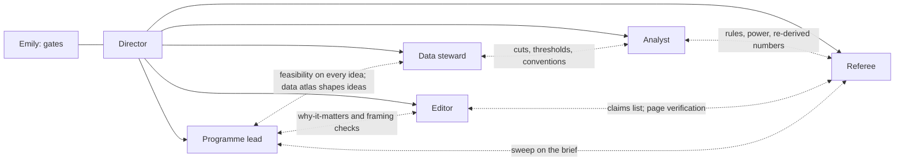

# A research team on Claude Managed Agents, from scratch

Version 2, 16 September 2026. Supersedes the first draft, which inherited the old programme. This version starts from nothing but the goal, the data, and Anthropic's published research. Platform facts are from the full documentation (`research/managed-agents-digest.md`); the failure modes it guards against are in `research/team/LESSONS.md`.

## 1. The goal

Produce outstanding empirical contributions to Anthropic's economic research: standalone research posts whose foundation is the Economic Index usage data, layered with other data only where a question needs it, each one an original addition to a thread of inquiry the economics stream at the Anthropic Institute is actually pursuing. Six posts is the target; quality sets the pace, not a date. The audience is the economists who wrote the reports, with Maxim Massenkoff as the intended mentor, and the purpose is to show Emily already doing the job.

Everything from the earlier programme is reference material, not inheritance. The team's first task is to decide, from a full review, what the posts should be.

## 2. What "Anthropic-grade" means, and how the team will define it properly

The first draft said a post "starts from a sentence Anthropic wrote." That is too narrow. A post should be *inspired by* an Anthropic thread of inquiry: a report chapter, a conjecture they left untested, a limitation they named, a measure they built, a question the Institute says it cares about. The relationship is "builds on," not "extends one sentence."

What the reports themselves do, which the team will take as the working standard and then re-derive from the corpus in Stage 1:

- **They open with why it matters**: the economic question, who is affected, and what the data can uniquely say. The key findings are stated up front in plain sentences, with the number and its caveat in the same breath.
- **They build measures carefully and say what they measure**: the AI Usage Index, automation and augmentation, task success, economic primitives, observed exposure. Definitions are verbatim and repeated; the classifier's limits are stated.
- **They compare against something**: earlier waves, other providers, official statistics, historical technologies, theoretical predictions. A number alone is never the finding; the comparison is.
- **They separate what they observe from what they conjecture**, and they revise in public ("this pushes back against a hypothesis we made last year").
- **They end with what was learned and why it matters**, sometimes with what they will do next, sometimes with recommendations, never with a template. Limitations are specific, not ritual.
- **They release the data and the code** and invite others to do more with it.

In Stage 1 the editor and the programme lead build a style-and-structure corpus from every Anthropic economics post and report (section order, opening moves, how findings are phrased, how figures are captioned, how limitations are written, how they close), and the seven criteria below are rewritten from that corpus before any post is briefed.

Working criteria, to be revised from the corpus:

1. Inspired by a named thread of Anthropic's inquiry; states plainly what it adds and where it overlaps.
2. Founded on the Economic Index releases in any of their components (Claude.ai, first-party API, Claude Code, the survey, the labour-market files); other data layered where the question needs it, and the layering justified.
3. Every construct verified against Anthropic's definitions and the actual columns; where the post builds on a published number, that number reproduced before anything new.
4. Assumptions sweep written before pre-registration and again before the draft.
5. Pre-registered hypotheses with rules that can fail and whose power is stated; deviations logged.
6. Every claim traceable to a number in an output file; MDE beside every null; noise checks for any geographic or small-cell claim.
7. Written as Anthropic writes: why it matters first, findings as plain sentences with their caveats, comparison as the finding, limitations a referee would raise first, a close about what was learned.

## 3. How the team works together

The platform constrains the shape: in a multiagent session all agents share one sandbox and filesystem, each has its own persistent context thread, and only the coordinator can message agents (specialists cannot message each other directly). So "everyone talks to everyone" is implemented two ways, and both are designed in:

- **Through files, always.** A `room/` directory in the repository is the team's conversation: every request and every answer is a short note with a fixed header (from, to, about, needs-reply-by-phase). Specialists read the notes addressed to them at the start of every turn. Files are durable, reviewable by Emily, and survive the session.
- **Through the director, when a reply is needed now.** The director relays a note to the addressee's thread and waits. Threads persist, so the addressee has its full history.

The interactions that matter, and what each produces:



| Agent | Consumes | Produces | Talks most to |
|---|---|---|---|
| **Director** | goal; calendar; journal; every status note | sequencing; relays; gate messages; journal entry at close | everyone; Emily |
| **Programme lead** | the corpus of Anthropic economics research; the Institute's stated interests; the mentor's Anthropic publications; the data atlas; the literature | publications wiki; open-questions ledger; threads-of-inquiry map; the long-list and scored short-list of questions; briefs | data steward (is this cut real, at what grain, with what coverage?); editor (does the why-it-matters land?); referee (sweep) |
| **Data steward** | every release and its documentation; supplementary sources | the data atlas (every dataset, every cut, grain, thresholds, conventions, traps, and the published numbers with their exact specifications); cached Parquet; fetch scripts; feasibility notes; replications | programme lead (during idea generation, continuously); analyst (during analysis) |
| **Analyst** | brief; atlas; pre-registration | scripts with check blocks; results.json; figures; notebook; deviations | data steward; referee |
| **Referee** | artifacts only, never reasoning | sweep verdicts; rule reviews with MDEs; independent re-derivations; red-team memo; claims list; sign-offs | analyst; editor; programme lead |
| **Editor** | the style corpus; brief; results.json; claims list; notebook; red-team memo | POST.md; page; claims map; pull request | referee; programme lead |

Two loops are new and deliberate, and both live in Stage 1. The **idea loop**: the programme lead does not generate ideas from the literature alone; it generates them from the literature *and* the data atlas, and every idea on the long-list carries a feasibility line written by the data steward before scoring. The **framing loop**: the editor reads each brief's why-it-matters and answers, in a room note, whether an economist would care and whether the close writes itself; a brief whose ending cannot be imagined is sent back.


### File ownership: every agent writes only its own files

Each path in the repository has exactly one owning agent. Only the owner creates or edits files under its paths; every other agent reads them and, if it has something to say, writes a note in `room/` or appends to a file it owns. Nothing is ever overwritten by a second agent; disagreements are notes, not edits. The referee never edits the analyst's scripts; the editor never edits results; the programme lead never edits the atlas. This rule is in every agent's definition and in the room-protocol skill, and the director sends back any turn that breaks it.

| Owner | Writes only under |
|---|---|
| Director | `room/director-*.md`, `programme/CALENDAR.md`, the research-journal memory store |
| Programme lead | `wiki/reports/`, `wiki/INDEX.md`, `programme/LEDGER.md`, `THREADS.md`, `LONGLIST.md`, `SHORTLIST.md`, `programme/briefs/` (short-list sketches only), `posts/postN/BRIEF.md` (the brief of record), `room/lead-*.md` |
| Data steward | `data/` (atlas, release files, fetch scripts, cache), `posts/postN/notes/feasibility.md`, `posts/postN/notes/replication.md`, `room/steward-*.md` |
| Analyst | `posts/postN/prereg/`, `scripts/`, `data/processed/`, `outputs/`, `notes/lab-notebook.md`, `notes/ideas.md`, `room/analyst-*.md` |
| Referee | `posts/postN/notes/referee-*.md`, `notes/red-team.md`, `notes/claims.md`, `notes/rederivation/`, `room/referee-*.md` |
| Editor | `wiki/style/`, `posts/postN/POST.md`, `notes/claims-map.json`, `site/`, `room/editor-*.md` |

Room notes are named `room/<owner>-<date>-<slug>.md` so ownership is visible in the filename. The pre-registration commit and the pull request are made by the director and the editor respectively with `git`, which records the author.

## 4. The agents, revised

- **Director** (coordinator, Fable 5.1, high). Sequences; relays; enforces gates; refuses retitles after the brief is frozen; writes the journal. No analysis, no prose.
- **Programme lead** (Opus 5, high; open web search and fetch, with primary sources first). In Stage 1 it owns the review; afterwards it briefs each post and keeps the ledger current as new reports appear.
- **Data steward** (Opus 5, high; open web search and fetch, for supplementary sources). Owns the atlas. During Stage 1 it profiles every release and every cut and reproduces every headline number it can with Anthropic's released code, recording the exact specification that reproduces it.
- **Analyst** (Opus 5, high; no web; effort is set per agent, not per turn).
- **Referee** (Fable 5.1, xhigh; open fetch, re-reads Anthropic's sources itself). Clean context. Four verdicts per post plus a Stage 1 verdict on the short-list scoring.
- **Editor** (Opus 5, high; open fetch for the style corpus; GitHub MCP with a static-bearer credential in a vault, push and pull-request tools `always_ask`). Broad context by design: it owns `wiki/style/`, a corpus of every Anthropic economics post and report annotated for structure, opening moves, phrasing of findings, captions, limitations and closes, plus the derived style skill. It writes every post against that corpus, not against a short rule list.

## 5. Three stages, and the sessions inside them

The work runs in three stages, each with its own outputs and its own gate, and nothing in the platform argues against it: sessions are cheap to create, files persist in the repository, and each stage's sessions can be sized to their work. What the platform does argue for is keeping each session's scope small and its hand-offs in files, so the stages are made of sessions rather than being one session each.

| Stage | Output | Sessions | Gate |
|---|---|---|---|
| **1. Research briefs** | The corpus, the data atlas, the style corpus, the open-questions ledger, the threads map, the long-list with feasibility lines, the scored short-list, and full briefs for the chosen six | One discovery session (restartable; outputs are files), then one short session for the six briefs | Gate 1a: Emily chooses the six from the short-list. Gate 1b: Emily approves the six briefs |
| **2. Doing the research** | Per post: cached data and replication; committed pre-registration; scripts with check blocks; results.json; figures; notebook; referee re-derivations, red-team memo and claims list | One session per post (isolated sandbox and context; the 30-day clock is comfortable); posts can run in parallel sessions if budget allows | Per post: Gate 2a pre-registration approved; Gate 2b results and claims list read before any prose |
| **3. Write-ups** | Per post: POST.md, the page with evidence drawers, the claims map, a pull request; and, across posts, consistency of register and cross-references | One session for the set, so the editor holds all six results and the style corpus at once; or one per post if the set is too large for one context | Per post: Gate 3 final page approved and merged |

Stage 1 is the most important and the most expensive in reading. It is done once, and the ledger and atlas are then maintained as new reports and releases appear.

### Stage 1 in detail


| Step | Owner | Output | Standard |
|---|---|---|---|
| 0.1 The corpus | Programme lead, editor | `wiki/reports/*.md`: one file per Anthropic economics publication (Economic Index reports and papers, country spotlights, labour-market and productivity papers, the fluency report, the survey, the Institute's economics posts, the mentor's Anthropic publications and the interests they state; his work outside Anthropic is out of scope). Each: claims with page references; definitions verbatim; data and methods; limitations verbatim; open questions and conjectures verbatim; what it did not test. `wiki/style/*.md`: the same publications annotated for structure and register. | Every quote verified against the source on the day it is written |
| 0.2 The data atlas | Data steward | `data/ATLAS.md` plus one file per release: every file, grain, facet or category, metric, threshold, convention, trap; the cuts that exist and the cuts that do not; the published numbers with the specification that reproduces them; supplementary sources that join cleanly, with keys and coverage | Every fact carries the command that verified it |
| 0.3 The open-questions ledger | Programme lead | `programme/LEDGER.md`: every "more research is needed," untested conjecture, named limitation, revised hypothesis and follow-up promised across the corpus, with source, date and whether any later report answered it | Cross-referenced to the atlas: which ledger items the public data can address |
| 0.4 The threads map | Programme lead | `programme/THREADS.md`: the threads of inquiry the economics stream is actually pursuing (adoption and diffusion; automation versus augmentation; task-level primitives and productivity; labour-market exposure and observed impacts; learning curves and skill; geography; the survey and self-reported effects; whatever else the corpus shows), what each has established, where each is open, and what the Institute says it wants next | Written from the corpus, with the mentor's interests marked |
| 0.5 The long-list | Programme lead with the data steward | `programme/LONGLIST.md`: thirty or more candidate questions, each with the thread it builds on, the contribution in one sentence, why it matters and to whom, the Economic Index cut it rests on, supplementary data if any, a feasibility line from the steward, and the biggest risk | No item without a feasibility line |
| 0.6 Scoring and short-list | Programme lead scores; referee audits the scoring; director assembles | `programme/SHORTLIST.md`: the top eight to ten, scored on originality against the corpus, fit with the threads and the mentor, foundation in usage data, feasibility, what it teaches, and risk; with a one-page brief sketch each | Referee signs off that scores are defensible and that no item is an inherited framing |
| **Gate 1a** | Emily | chooses six, orders them, or sends the list back | |
| 0.7 Briefs | Programme lead, steward, editor, referee | `programme/briefs/*.md` for the six, full template | Each passes the steward's feasibility, the editor's framing loop and the referee's sweep; **Gate 1b**: Emily approves all six |

Stage 1 is long by design. It should take the team several days of session time and Emily a few hours of reading. Nothing from the old programme enters it except as citations in the wiki (posts 1 and 2 are two data points on what the public files can and cannot do, and their lessons are already in the journal).

### Stage 2 in detail, per post

1. **Replicate and cache** (steward): data cached; the published number the post builds on reproduced with Anthropic's code; atlas updated.
2. **Pre-registration** (analyst drafts; referee reviews every rule for specification and power; director commits with git). **Gate 2a.**
3. **Analysis** (analyst; the fixed confirmatory set; a small exploratory allowance; outcome rubric on structure: every script has a check block, every coefficient an interval and MDE).
4. **Verification** (referee: three numbers re-derived from raw; deviations judged; red-team memo; claims list). **Gate 2b**, before any prose exists.
5. **Close** (director: journal; ledger updated with what the post answered and what it opened).

### Stage 3 in detail

1. **Write-up** (editor, from brief, results.json, claims list, notebook and red-team memo, against the three closest examples in the style corpus; page built; verification script passes; outcome rubric: every number on the page in results.json, no first person, limitations present).
2. **Review** (referee checks every quantitative sentence, the title, the opening claim and the register; then the director).
3. **Pull request** (editor, `always_ask` on push and PR). **Gate 3.**
4. **Set review** (editor, once all six exist: consistency of terms, cross-references between posts, the site index).

## 7. What lives where

```
GitHub: <repo> (private until release)
  README.md                  the goal; the criteria; how the room works
  room/                      the team's conversation: dated notes with from/to/about headers
  wiki/reports/              one file per Anthropic economics publication (claims, definitions, limitations, open questions)
  wiki/style/                the same publications annotated for structure and register; the derived style guide
  data/ATLAS.md, data/releases/*.md, data/fetch/, data/cache/ (gitignored)
  programme/LEDGER.md, THREADS.md, LONGLIST.md, SHORTLIST.md, briefs/, CALENDAR.md
  posts/postN/               PLAN, prereg/, scripts/, data/processed/results.json, outputs/, notes/, POST.md, build_page.py
  site/                      the public site
  team/agents/*.md, environment.yaml, run_session.py, templates/ (ROOM-NOTE, BRIEF, PREREG, RESULTS schema, CLAIMS, NOTEBOOK, RED-TEAM, POST, VERDICT)
  .claude/skills/            economic-index-data, empirical-standards, qc-rubric (includes the assumptions sweep), room-protocol, anthropic-style (stub → derived in Stage 1), page-build (stub → generalised in Stage 1)
  reference/                 the old programme and posts 1 and 2, read-only, cited not inherited
Memory stores: standards (read-only: criteria, terminology, register), research-journal (read-write: lessons, quirks, decisions, status)
```

## 8. Sessions, cost and limits

- Stage 1: one discovery session plus one briefs session. Stage 2: one session per post. Stage 3: one session for the set, or one per post. Sessions are cheap; outputs are files, so a restart loses nothing. Sandbox lives at most 30 days from creation; the repository is the memory of record.
- Environment: one cloud environment with the analysis packages pre-installed and unrestricted networking (Anthropic's safety blocklist still applies) while the atlas is being built; tighten to an allowlist once the sources are fixed (`team/environment.yaml`).
- Budgets: hard cap per session, raised at each gate; Stage 1 will be the most expensive because of the reading; plan on the order of a few hundred dollars for Stage 1 and $200 to 500 per post, with the cap as the control.
- Human gates: 1a (short-list) and 1b (briefs); 2a and 2b per post; 3 per post. Pushing and pull requests are `always_ask`; everything else runs.

## 9. Step by step

1. **Emily:** create the private repository; a fine-grained token with `repo` scope for it; confirm API credits and model access; install the CLI (`brew install anthropics/tap/ant`).
2. **Claude:** create the repository layout with only tooling, templates, skills and `reference/`; no programme, no briefs.
3. **Claude:** the templates (room note, brief, pre-registration, results schema, claims list, notebook, red-team memo, post, verdict) and the skills are written (`team/templates/`, `team/skills/`); anthropic-style and page-build are stubs that the editor rewrites in Stage 1 from the corpus and the reference build script.
4. **Claude:** create the two memory stores; seed the journal from `LESSONS.md`; seed standards with the working criteria and the verified terminology.
5. **Claude:** apply the environment, the five specialists, then the director.
6. **Claude + Emily:** Stage 1: run the discovery session with the kick-off message "build the corpus, the atlas, the style corpus, the ledger, the threads map and the long-list with feasibility lines, score a short-list, then stop." Emily reads; Gate 1a. Then the briefs session; Gate 1b.
7. **Stage 2:** one session per post, in the order she chose; Gates 2a and 2b each.
8. **Stage 3:** the write-up session(s); Gate 3 each; the set review last.

## 10. What Emily decides

1. Repository name; private until release.
2. Session cap for Stage 1 and per post.
3. Decided: referee and director on Fable 5.1 (`claude-fable-5-1`); specialists on Opus 5.
4. Decided: the mentor's work outside Anthropic is out of scope; his Anthropic publications and stated interests are in.
